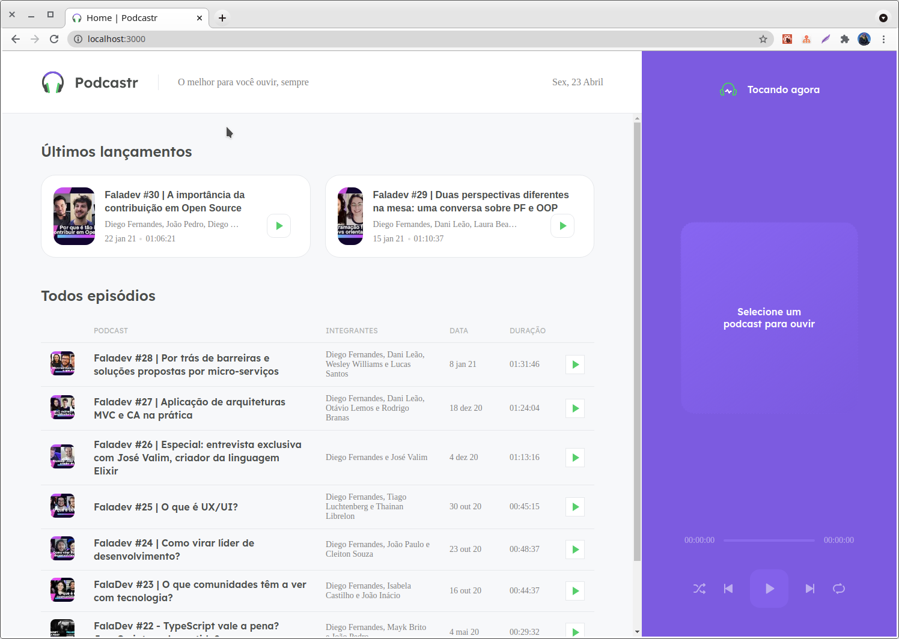
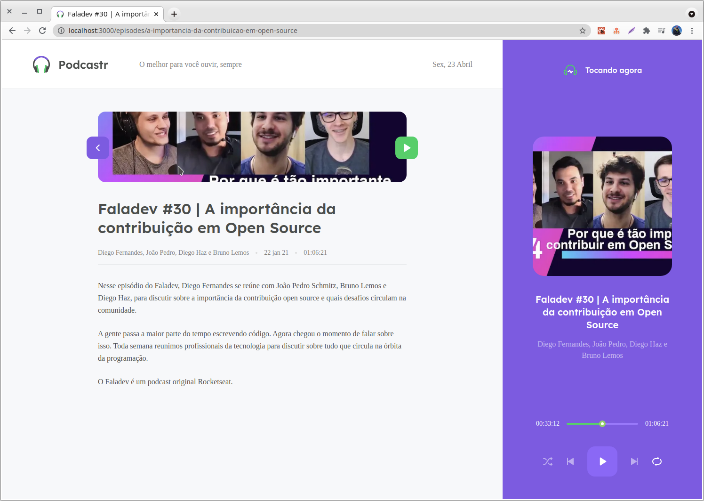

<h1 align="center">
  Training NLW5 - 2021
</h1>

<h3 align="center">
  Treinamento NextJs/React
</h3>

<blockquote align="center">“O tempo que leva para realizar seus sonhos vai passar de qualquer forma”!</blockquote>

  

  

  

  <a href="#rocket-sobre-o-desafio">Sobre o treinamento</a>&nbsp;&nbsp;&nbsp;|&nbsp;&nbsp;&nbsp;
  <a href="#memo-licença">Licença</a>

## 🚀 Sobre o desafio
----
Durante esse desafio foi construído o app Podcastr.

  
  

## 📅 Entrega
...

## 📝 Licença

Esse projeto está sob a licença MIT. Veja o arquivo [LICENSE](LICENSE.md) para mais detalhes.

---